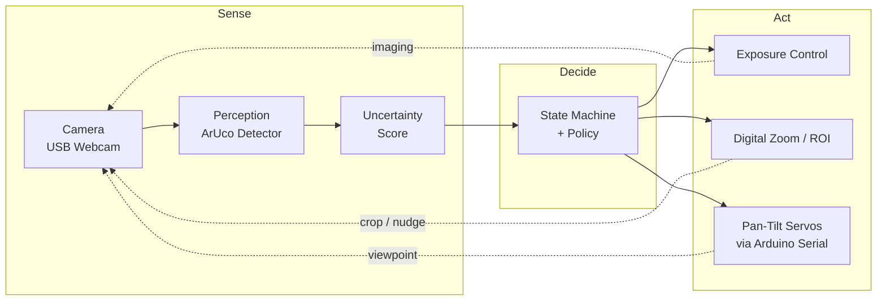
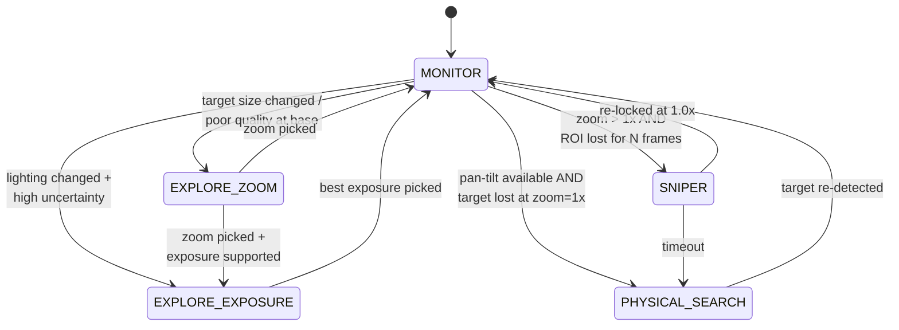

# Active Perception Camera System

A camera-based **active perception system** that dynamically adjusts its sensing viewpoint based on perception uncertainty, closing the loop between sensing, decision-making, and physical action.

---
Activate the venv (.\venv\Scripts\Activate.ps1).
## Overview

Traditional computer vision systems operate on static, single-frame inputs.In contrast, **active perception** treats sensing as a decision-making process:  when perception confidence is low, the system actively changes *how* it senses the environment.

This project implements a **hardware-in-the-loop active perception pipeline** using a movable pan-tilt camera. The system continuously evaluates visual confidence and adapts its camera viewpoint to improve perception robustness under challenging real-world conditions such as:

- Low illumination  
- Small target size
- Motion blur  
- Limited depth of field  
- Suboptimal viewing angles  

The goal of this project is **system-level perception design**, not maximizing model accuracy.

---

## Key Concepts Demonstrated

- Active / embodied perception  
- Uncertainty-aware decision making  
- Closed-loop sensing–action systems  
- Camera viewpoint control as a perception strategy  
- Robust perception under real-world imaging noise  

---

## System Architecture

The system is a **closed sense–decide–act loop**: every frame is scored for perception confidence, and when confidence drops, the policy reaches for a different *action* — exposure, digital zoom, or a physical pan-tilt move — to recover.

### High-Level Loop



### State Machine

The active perception loop is implemented as an explicit FSM in `src/states.py`. Each state owns one recovery strategy; transitions are driven by uncertainty and detection history.



> Detailed module/state explanations live in `Implementation_plan.md`. Hardware wiring and Arduino setup live under `hardware/`.

---

## Hardware Setup

### Core Hardware Components

| Component | Description | Price on Amazon 2026
|---------|-------------|
| Camera | Logitech Brio 100 USB Webcam | 25 dollars
| Pan-Tilt Platform | Yahboom 2-DOF Servo Pan-Tilt Kit | 50 dollars
| Microcontroller | Arduino Nano / Arduino Uno | 20 dollars
| Power Supply | External 5V supply (MB102 breadboard module) | 10 dollars
| Control Interface | USB Serial (PC ↔ Arduino) |

### Hardware Design Notes

- The camera is mounted on a 2-DOF pan-tilt platform to enable physical viewpoint changes.
- Servo motors are powered by an external 5V supply to ensure stability.
- Arduino handles low-level motor control; perception and policy logic run on the PC.
- Mounting prioritizes stability and modularity over mechanical precision.

---

## Software Architecture

### Software Stack

- **Language**: Python (PC), Arduino C++
- **Vision**: OpenCV
- **Communication**: pySerial
- **OS**: Windows 10

### Repository Structure

```
active-perception-camera-system/
├── README.md
├── hardware/
│   ├── wiring_diagram.md
│   └── pan_tilt_setup.md
├── src/
│   ├── camera.py
│   ├── perception.py
│   ├── uncertainty.py
│   ├── policy.py
│   ├── controller.py
│   └── main_loop.py
├── experiments/
│   ├── low_light_test.md
│   ├── blur_test.md
│   └── viewpoint_comparison.md
├── logs/
└── requirements.txt

```

---

## Active Perception Strategy

Instead of relying on lens autofocus or static inference, the system treats **viewpoint selection as a perception action**.

Typical loop:

1. Capture frame  
2. Run perception  
3. Estimate uncertainty  
4. Adjust viewpoint if confidence is low  
5. Re-evaluate perception  

This mirrors strategies used in robotics and embodied AI systems.

---

## Project Goals

- Demonstrate system-level perception thinking
- Explore sensing–action coupling
- Build a reusable foundation for embodied perception experiments

---

## Future Work

- Multi-view fusion
- Learned action policies
- Continuous viewpoint optimization
- Sensor fusion (IMU, depth)
- Mobile platforms

---

## Troubleshooting

### Servo moves far beyond expected range after restart

**Symptom**: After restarting the Python program, the pan-tilt stage moves to extreme angles that clearly exceed the configured software limits (`TILT_MIN`/`TILT_MAX`).

**Root Cause**: Position tracking desynchronization between the Python software and the physical servo state. This happens when:
1. The previous Python session exits without homing the servos (crash, Ctrl+C, terminal closed).
2. The Arduino stays powered — servos remain at their last commanded position (e.g. tilt=130°).
3. On the next Python startup, `HardwareController` assumes the stage is at home (90°, 90°), but physically it is elsewhere.
4. All subsequent relative commands (`nudge`, `move_by`) accumulate on top of this incorrect baseline, causing the stage to exceed its intended range.

**Quick Fix**: Disconnect and reconnect the Arduino USB cable. This power-cycles the Arduino, which runs `setup()` → `writeHomePose()` and physically resets the servos to (90, 90), re-aligning hardware and software state.

**Permanent Fix (already applied)**: The `HardwareController` now sends a home command in both `connect()` and `close()`, and `ActivePerceptionLoop` calls `home(smooth=True)` before closing. This ensures the stage always returns to home on shutdown and re-syncs on startup, eliminating the desync regardless of how the previous session ended.

---

## Disclaimer

This project is for educational and experimental purposes only.

---


