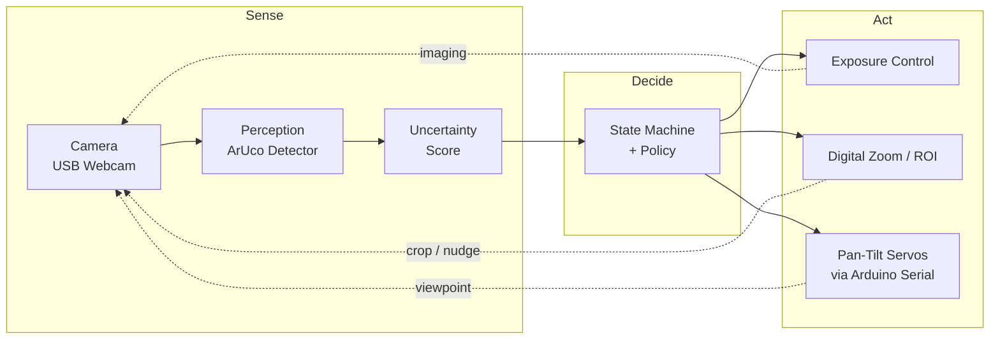
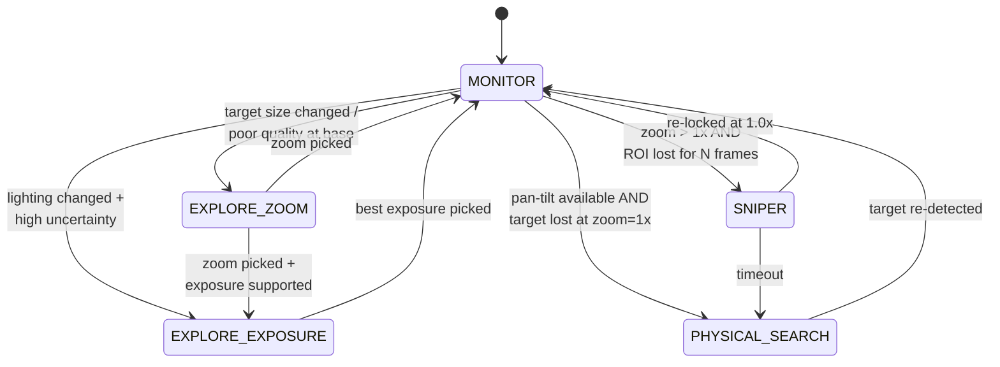

# Active Perception Camera System

A camera-based **active perception system** that dynamically adjusts its sensing viewpoint based on perception uncertainty, closing the loop between sensing, decision-making, and physical action.

---

## Overview

Traditional computer vision systems operate on static, single-frame inputs. In contrast, **active perception** treats sensing as a decision-making process: when perception confidence is low, the system actively changes *how* it senses the environment.

This project implements a **hardware-in-the-loop active perception pipeline** using a movable pan-tilt camera. The system continuously evaluates visual confidence and adapts its camera viewpoint to improve perception robustness under challenging real-world conditions such as:

- Low illumination  
- Small target size
- Motion blur  
- Limited depth of field  
- Suboptimal viewing angles  

The goal of this project is **system-level perception design**, not maximizing model accuracy.

---

## Key Concepts Demonstrated

- Active / embodied perception  
- Uncertainty-aware decision making  
- Closed-loop sensing–action systems  
- Camera viewpoint control as a perception strategy  
- Robust perception under real-world imaging noise  

---

## System Architecture

The system is a **closed sense–decide–act loop**: every frame is scored for perception confidence, and when confidence drops, the policy reaches for a different *action* — exposure, digital zoom, or a physical pan-tilt move — to recover.

### High-Level Loop



### State Machine

The active perception loop is implemented as an explicit FSM in `src/states.py`. Each state owns one recovery strategy; transitions are driven by uncertainty and detection history.



> Detailed module/state explanations live in `Implementation_plan.md`. Hardware wiring and Arduino setup live under `hardware/`.

---

## Hardware Setup

### Core Hardware Components

| Component          | Description                                   | Price (USD, Amazon 2026) |
| ------------------ | --------------------------------------------- | ------------------------ |
| Camera             | Logitech Brio 100 USB Webcam                  | ~$25                     |
| Pan-Tilt Platform  | Yahboom 2-DOF Servo Pan-Tilt Kit              | ~$50                     |
| Microcontroller    | Arduino Nano / Arduino Uno                    | ~$20                     |
| Power Supply       | External 5V supply (MB102 breadboard module)  | ~$10                     |
| Control Interface  | USB Serial (PC ↔ Arduino)                     | —                        |

**Total**: ~$105. The whole system runs on an off-the-shelf laptop + hobby-grade servos — no special compute or industrial actuators required.

### Hardware Design Notes

- The camera is mounted on a 2-DOF pan-tilt platform to enable physical viewpoint changes.
- Servo motors are powered by an external 5V supply to ensure stability under load.
- Arduino handles low-level motor control; perception and policy logic run on the PC.
- Mounting prioritizes stability and modularity over mechanical precision.

Full assembly, wiring, firmware flashing and calibration instructions: **[`hardware/README.md`](hardware/README.md)**.

---

## Quick Start

### 1. Install

```powershell
# Windows PowerShell
python -m venv venv
.\venv\Scripts\Activate.ps1
pip install -r requirements.txt
```

### 2. Flash the Arduino (optional — only if using the pan-tilt)

Open `hardware/arduino/pan_tilt_serial/pan_tilt_serial.ino` in the Arduino IDE and upload to your board. Full wiring and bring-up steps are in [`hardware/README.md`](hardware/README.md).

### 3. Run

```powershell
# Full system — default perception is mixed (ArUco + face, see --mixed-policy); face registry defaults to ./face_registry
python main.py

# Marker-only or face-only
python main.py --perception aruco
python main.py --perception face

# Different camera or serial port
python main.py --cam 0 --port COM4

# Disable pan-tilt even if connected
python main.py --no-pan-tilt

# Debug mode (per-frame blackbox logging into logs/blackbox/)
python main.py --debug

# Other modes (uncertainty inspection, policy demo, benchmark)
python main.py --mode uncertainty
python main.py --mode benchmark --duration 30
```

Press `q` in the video window to exit; the stage will auto-home on shutdown.

### Voice control (optional, Session 30)

Offline **push-to-talk** voice runs in-process: microphone → ASR → rules (optional local **Ollama** JSON fallback) → validated commands → pan-tilt / search flag. In the video window, press **`v`** to record one utterance (see `--voice-record-seconds`).

```powershell
python main.py --voice --debug --no-pan-tilt
python main.py --voice --voice-llm --voice-llm-model qwen2.5:1.5b
```

Full CLI flags, blackbox `event_type` names, and interaction with visual tracking / gestures are in **[`docs/API.md`](docs/API.md)** (voice section). ASR and intent behavior: [`docs/VOICE_ASR.md`](docs/VOICE_ASR.md), [`docs/VOICE_INTENT.md`](docs/VOICE_INTENT.md).

### Limitations and safety

- **ASR** may transcribe incorrectly; an optional **local LLM** may still output `noop` or a wrong but schema-valid command. The executor only runs **whitelist** JSON and hardware limits still apply—treat voice as **assistive**, not safety-critical.
- **Physical stop:** remove servo power or unplug the Arduino USB cable; software cannot guarantee instant mechanical stop.
- Session design notes and acceptance ideas: [`Implementation_plan.md`](Implementation_plan.md) (Week 7 — Session 30).

---

## Software Architecture

### Software Stack

- **Language**: Python 3.10+ (PC), Arduino C++ (firmware)
- **Vision**: OpenCV (ArUco detection)
- **Communication**: pySerial
- **OS**: Developed on Windows 10/11; Linux/macOS should work with the correct serial device name

### Repository Structure

```
active-perception-camera-system/
├── README.md                   # This file
├── Implementation_plan.md      # 5-week build log + design notes
├── main.py                     # Unified CLI entry (full/uncertainty/policy/benchmark)
├── demo.py                     # Thin demo entry (full system only)
├── requirements.txt
│
├── src/                        # Core Python modules
│   ├── camera.py               # USB webcam wrapper
│   ├── perception/             # ArUco + face backends (`create_perception`)
│   ├── uncertainty.py          # Confidence scoring
│   ├── policy.py               # Exposure / zoom / ROI actions
│   ├── controller.py           # HardwareController (pan-tilt over serial)
│   ├── states.py               # Finite state machine (Monitor / Explore / Sniper / Search)
│   ├── loop.py                 # ActivePerceptionLoop — main orchestrator
│   ├── voice/                  # Session 30: ASR → intent → executor (PTT)
│   ├── logger.py               # Blackbox event + screenshot logging
│   ├── benchmark.py            # Baseline vs active comparisons
│   └── __init__.py
│
├── hardware/
│   ├── README.md               # Hardware build guide (start here for the physical side)
│   ├── wiring_diagram.md
│   ├── pan_tilt_setup.md
│   └── arduino/
│       └── pan_tilt_serial/
│           └── pan_tilt_serial.ino   # Servo firmware (PAN/TILT over serial)
│
├── docs/
│   ├── API.md                  # CLI, voice blackbox, HardwareController, loop, serial protocol
│   ├── VOICE_ASR.md            # faster-whisper / mock ASR
│   └── VOICE_INTENT.md         # rules + optional Ollama bundle
│
├── scripts/
│   └── make_gif.py             # Blink GIF / side-by-side from HUD screenshots (social posts)
│
└── logs/                       # Runtime outputs (gitignored)
    └── blackbox/<timestamp>/   # events.jsonl + screenshots per run
```

CLI flags, `HardwareController` methods, `ActivePerceptionLoop` parameters, and the Arduino serial protocol are documented in **[`docs/API.md`](docs/API.md)**.

---

## Active Perception Strategy

Instead of relying on lens autofocus or static inference, the system treats **viewpoint selection as a perception action**.

Typical loop:

1. Capture frame
2. Run perception
3. Estimate uncertainty
4. Pick an action (adjust exposure / zoom / physical viewpoint) if confidence is low
5. Re-evaluate perception

This mirrors strategies used in robotics and embodied AI systems. See the [State Machine](#state-machine) diagram above for the actual transitions.

---

## Project Goals

- Demonstrate system-level perception thinking
- Explore sensing–action coupling
- Build a reusable foundation for embodied perception experiments

---

## Next Steps

**In progress**

- [ ] Face and hand detection / recognition (MediaPipe or lightweight ONNX models) — replace ArUco as the target, while keeping the same uncertainty-driven FSM.

**Longer horizon**

- Multi-view fusion
- Learned action policies (RL for action selection)
- Continuous viewpoint optimization
- Sensor fusion (IMU, depth)
- Mobile platforms (mount on a wheeled base)

---

## Troubleshooting

### Servo moves far beyond expected range after restart

**Symptom**: After restarting the Python program, the pan-tilt stage moves to extreme angles that clearly exceed the configured software limits (`TILT_MIN`/`TILT_MAX`).

**Root Cause**: Position tracking desynchronization between the Python software and the physical servo state. This happens when:
1. The previous Python session exits without homing the servos (crash, Ctrl+C, terminal closed).
2. The Arduino stays powered — servos remain at their last commanded position (e.g. tilt=130°).
3. On the next Python startup, `HardwareController` assumes the stage is at home (90°, 90°), but physically it is elsewhere.
4. All subsequent relative commands (`nudge`, `move_by`) accumulate on top of this incorrect baseline, causing the stage to exceed its intended range.

**Quick Fix**: Disconnect and reconnect the Arduino USB cable. This power-cycles the Arduino, which runs `setup()` → `writeHomePose()` and physically resets the servos to (90, 90), re-aligning hardware and software state.

**Permanent Fix (already applied)**: The `HardwareController` now sends a home command in both `connect()` and `close()`, and `ActivePerceptionLoop` calls `home(smooth=True)` before closing. This ensures the stage always returns to home on shutdown and re-syncs on startup, eliminating the desync regardless of how the previous session ended.

### Face mode: `module 'cv2' has no attribute 'face'`

**Cause**: The lightweight `opencv-python` wheel does not ship the `cv2.face` submodule (LBPH / Eigen / Fisher recognizers).

**Fix**: Use **only** `opencv-contrib-python` in that environment (do not install both):

```bash
pip uninstall opencv-python opencv-contrib-python -y
pip install opencv-contrib-python>=4.8
python -c "import cv2; assert hasattr(cv2, 'face')"
```

`requirements.txt` already lists `opencv-contrib-python`; reinstall if you previously had `opencv-python` alone.

### Face mode: exposure sweep makes recognition worse

**Same logic as ArUco**: `ExploreExposureState` / `ExploreZoomState` still minimize **`raw_u`** from `UncertaintyEngine` (sharpness + bbox area + detection). There is **no separate** face-specific exposure math yet—only different **size/sharpness** defaults for faces in `ActivePerceptionLoop`.

**Why blow-out breaks “Aaron Xie”**: LBPH is trained on your saved JPEGs. If the sweep locks a **much brighter** exposure than enrollment, gradients on the face change and the LBPH distance spikes → `?`.

**Mitigations**: (1) capture enrollment under lighting similar to the run; (2) after code update, face mode **ties** toward a **shorter-exposure** bias when picking the sweep winner; (3) for a stable demo, temporarily run with exposure control off if you add a flag later, or avoid entering EXPLORE while tuning.

---

## Disclaimer

This project is for educational and experimental purposes only.

---


